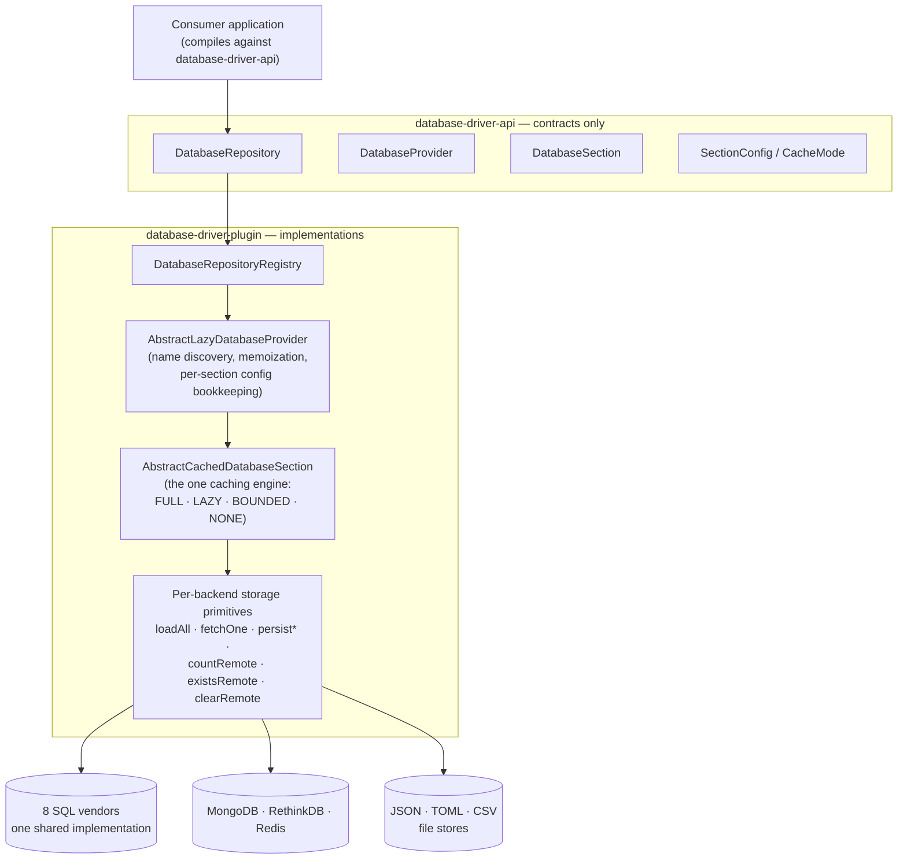
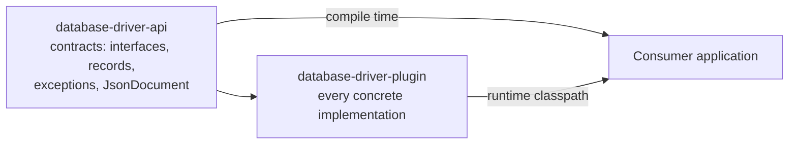
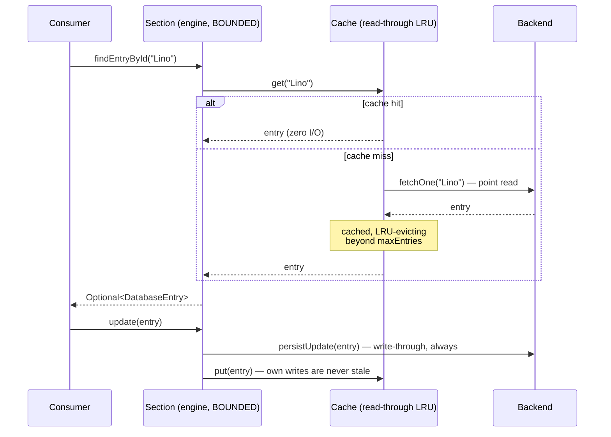

# DatabaseDriver


`database-driver-v2` is a management system for multiple SQL and NoSQL database types,
controlled through a single, unified Java interface. Instead of learning a separate API for
every backend, you work against `DatabaseRepository`, `DatabaseProvider`, `DatabaseSection` and
`DatabaseEntry` — the same four abstractions regardless of whether the data actually lives in
MySQL, MongoDB, Redis or a plain directory of JSON, TOML or CSV files. Every operation is also
available in a non-blocking, `CompletableFuture`-based variant, and every section's memory
footprint is configurable per section — from "everything cached in memory" down to "nothing at
all".

This README is the map of the project: what it does, how it is built, and how every public
surface is used.

---

## Table of Contents

- [Overview](#overview)
- [Features](#features)
- [Architecture](#architecture)
  - [System Architecture](#system-architecture)
  - [Module Architecture](#module-architecture)
  - [Data Flow](#data-flow)
- [Modules](#modules)
- [Project Structure](#project-structure)
- [Supported Databases](#supported-databases)
- [Requirements](#requirements)
- [Installation](#installation)
- [Quick Start](#quick-start)
- [DatabaseDriver API](#databasedriver-api)
  - [Working with the DatabaseRepository](#working-with-the-databaserepository)
  - [Working with a DatabaseProvider](#working-with-a-databaseprovider)
  - [Working with a DatabaseSection](#working-with-a-databasesection)
  - [Per-section cache modes](#per-section-cache-modes)
  - [Database Credentials](#database-credentials)
- [Export: `ExportCoordinator`](#export-exportcoordinator)
- [Caching: `Cache` / `ClusteredCache`](#caching-cache--clusteredcache)
- [Push Notifications: `DatabaseNotification`](#push-notifications-databasenotification)
- [Development](#development)
- [Testing](#testing)
- [Known Limitations](#known-limitations)
- [Roadmap](#roadmap)
- [AI-Assisted Development](#ai-assisted-development)
- [License](#license)
- [Author](#author)

---

## Overview

The driver is **one library, two Maven artifacts**: `database-driver-api` holds nothing but
contracts — the four core abstractions, the per-section cache configuration, the JSON document
model, the export/cache/notification contracts — and `database-driver-plugin` holds every
concrete implementation behind them. A consumer compiles against `-api` and puts `-plugin` on
the runtime classpath; nothing in application code ever names a concrete backend class.

Thirteen backends hide behind the same interface. All eight SQL vendors share one
implementation (each table is a trivial `(id, data)` pair, the document serialized into the
`data` BLOB), while every NoSQL backend — MongoDB, RethinkDB, Redis, and the JSON/TOML/CSV file
stores — maps sections onto its own native concept (collection, table, key prefix, directory,
file). One shared **caching engine** sits behind every backend and owns the question the
backends used to answer six different ways: *which entries live in heap, and when are they
loaded?* The answer is configurable per section — see
[Per-section cache modes](#per-section-cache-modes) — and connecting to a database costs time
proportional to its number of tables, never to the data inside them.

## Features

### Unified storage API

- One CRUD surface (`insert`/`update`/`delete`/`findEntryById`/`exists`/`count`/`clear`/`reload`)
  over 13 SQL and NoSQL backends
- Sections (tables/collections/prefixes/directories) managed uniformly:
  create, delete, list, rediscover
- Every operation in a blocking and an `Async` (`CompletableFuture`) variant
- Entries are schema-less `JsonDocument`s with a fluent, type-safe accessor API
- Whole-provider conversion: copy every section and entry from one backend into another
  (`DatabaseRepository#convert`)

### Memory control

- Per-section cache modes: `FULL` (classic), `LAZY` (load on first access),
  `BOUNDED(maxEntries[, ttl])` (read-through LRU), `NONE` (zero heap)
- Lazy section discovery: connecting a provider reads names only — sections nobody asks for are
  never loaded
- Streaming reads (`forEachEntry`) in constant memory, and stable, id-ordered pagination
  (`getEntries(offset, limit)`) pushed down to the backend where it can order and slice natively
- Per-section cache statistics (hits, misses, load count/duration) and an external-invalidation
  hook for multi-process deployments

### Beyond storage

- `ExportCoordinator`: transcript-style exports to PDF/Excel/CSV/XML/JSON/DOCX, flat-table
  exports via injected exporters, whole-directory ZIP archives
- A standalone async `Cache`/`ClusteredCache` SPI (stampede protection, TTL, approximate-LRU
  size bound), usable by any consumer
- `DatabaseNotification`: push-style row-change notifications (PostgreSQL `LISTEN`/`NOTIFY`;
  Redis sections publish a compatible change feed)
- Self-seeding `Credentials` config files: pass connection details once, read them from disk
  ever after

## Architecture

### System Architecture



Every backend supplies only its storage primitives; caching strategy, write-through rules,
exception behavior and pagination live exactly once, in the engine.

### Module Architecture

Dependency direction is strictly one-way:



`database-driver-api` must never depend on `database-driver-plugin`, and it carries no
third-party database drivers — only Guava, Gson, Lombok and the JetBrains annotations.
Implementation discovery that crosses the boundary (the `Cache` SPI) runs over
`java.util.ServiceLoader`.

### Data Flow

A representative read on a `BOUNDED`-mode section — the path that keeps heap flat while every
entry stays reachable:



Writes behave identically in every mode: persist first, then synchronize whatever cache state
exists. `FULL`/`LAZY` serve reads from a materialized in-memory view instead; `NONE` sends
every call straight to the backend.

## Modules

| Module | Artifact | Responsibility |
|---|---|---|
| `database-driver-api` | `database-driver-api` | The public API: `DatabaseRepository`, `DatabaseProvider`, `DatabaseSection`, `DatabaseEntry`, `Credentials`, the per-section cache configuration (`SectionConfig`/`CacheMode`), the JSON document model (`JsonDocument`), the driver's exceptions, the `Cache`/`ClusteredCache` contracts, the export contracts, and the `DatabaseNotification` push-notification contract |
| `database-driver-plugin` | `database-driver-plugin` | The concrete implementation: `DatabaseRepositoryRegistry`, the shared section caching engine (`AbstractCachedDatabaseSection`) and lazy section discovery (`AbstractLazyDatabaseProvider`), one `DatabaseProvider`/`DatabaseSection` pair per supported backend, the default `Cache`/`ClusteredCache` implementations (ServiceLoader-registered), `ExportCoordinator`, and `PostgresDatabaseNotification` |

## Project Structure

```text
database-driver-v2/
├── database-driver-api/                          # contracts (no database drivers)
│   └── src/main/java/de/lino/database/
│       ├── DatabaseRepository.java               # entry point, singleton accessor
│       ├── database/                             # DatabaseProvider/Section/Type, SectionConfig, CacheMode
│       │   ├── auth/                             # Credentials (self-seeding config file)
│       │   ├── entity/                           # DatabaseEntry, Serialized
│       │   ├── exception/                        # DataAlreadyExist, NoSuchEntryFound, NoSuchDataFound
│       │   └── notification/                     # DatabaseNotification contract
│       ├── json/                                 # JsonDocument model + FileProvider contract
│       └── utils/                                # Cache/ClusteredCache contracts, export contracts
├── database-driver-plugin/                       # implementations
│   └── src/main/java/de/lino/database/
│       ├── DatabaseRepositoryRegistry.java       # concrete repository + TTL sweep scheduler
│       ├── database/
│       │   ├── AbstractCachedDatabaseSection.java   # the caching engine (all modes)
│       │   ├── AbstractLazyDatabaseProvider.java    # lazy discovery + section lifecycle
│       │   ├── sql/                              # shared SQL impl + 8 vendor subpackages
│       │   └── nosql/                            # mongodb/ rethinkdb/ redis/ json/ toml/ csv/
│       └── utility/                              # DefaultCache, ExportCoordinator, ...
│   └── src/test/java/                            # JUnit 5 suite (engine, modes, paging, TOML)
├── .github/workflows/                            # CI (build+test) and release publishing
├── release-and-package.sh                        # version bump + tag + GitHub release, run manually
└── pom.xml                                       # Maven reactor root
```

## Supported Databases

### Relational (SQL) Databases

| **Database**                                                       | **Description**                                                                                                                       |
|----------------------------------------------------------------------|------------------------------------------------------------------------------------------------------------------------------------------|
| [MySQL](https://www.mysql.com/)                                    | Widely used for web applications, content management systems (e.g., WordPress), and general relational data storage.                    |
| [MariaDB](https://mariadb.org)                                     | Drop-in replacement for MySQL with improved performance, security features, and enterprise support; used in web and cloud applications.  |
| [PostgreSQL](https://www.postgresql.org/)                          | Advanced relational database for complex queries, analytics, GIS (geospatial data), and enterprise applications needing strong standards compliance. |
| [SQLite](https://www.sqlite.org)                                   | File-based, serverless database often used in mobile apps, embedded systems, small desktop tools, and prototyping.                       |
| [H2 Database](https://www.h2database.com)                          | Lightweight, in-memory or embedded database mainly for development, testing, or small applications where fast setup is needed.           |
| [Apache Derby](https://db.apache.org/derby)                        | Runs in-process (embedded), so it's ideal for small apps or unit tests. Not recommended for high-traffic production.                      |
| [Microsoft SQL Server](https://www.microsoft.com/de-de/sql-server) | Strong integration with the Microsoft ecosystem. Scales well for medium to large enterprise apps.                                        |
| [Oracle Database](https://www.oracle.com/database/)                | Designed for high concurrency, reliability, and large datasets. Often used in industries that need high availability and complex transactions. |

### Non-Relational (NoSQL) Databases

| **Database**                         | **Description**                                                                                                                                                                                                 |
|----------------------------------------|-------------------------------------------------------------------------------------------------------------------------------------------------------------------------------------------------------------------|
| [MongoDB](https://www.mongodb.com/)   | Document-oriented NoSQL database, great for handling flexible, semi-structured data (e.g., JSON), often used in scalable web and cloud apps.                                                                     |
| [RethinkDB](https://rethinkdb.com)    | Real-time NoSQL database optimized for apps requiring live updates and push notifications (e.g., chat apps, dashboards).                                                                                         |
| JSON File Store                       | Very simple storage solution using local JSON files; suitable for small projects, configs, or prototyping without the overhead of a full database server.                                                       |
| TOML File Store                       | Same one-directory-per-section, one-file-per-entry layout as the JSON store, but each entry is a human-editable [TOML](https://toml.io) file — handy when stored data doubles as configuration. TOML's model limits apply: no `null` values (dropped on write) and homogeneous arrays only.                    |
| CSV File Store                        | Flat-file storage using one CSV file per section (one row per entry); like the JSON file store but keeps a whole section in a single file instead of one file per entry. Both columns are Base64-encoded so arbitrary ids/documents always round-trip safely, so the raw file isn't meant to be hand-edited. |
| [Redis](https://redis.io)             | Redis is an open-source, in-memory data store used worldwide for high-speed data storage and retrieval. It powers applications as a cache, database, and message broker, enabling real-time analytics, fast session management, and scalable messaging systems. |

> **Note:** The `database-driver-plugin` module ships JDBC drivers for PostgreSQL, H2, SQLite and
> MariaDB (plus the MongoDB, RethinkDB and Jedis/Redis clients, and the `toml4j` parser behind
> the TOML file store) out of the box. It does **not** bundle drivers for **MySQL**, **Oracle**,
> **Microsoft SQL Server** or **Apache Derby** — add the corresponding JDBC driver as an extra
> dependency in your project if you use one of these.

## Requirements

| Requirement | Notes |
|---|---|
| JDK **21** | Both modules' compiler source/target; consumers need a Java 21+ runtime |
| Maven 3.x | No wrapper is committed — use a local install |
| GitHub Packages read access | The artifacts are published to GitHub Packages, not Maven Central — a PAT with `read:packages` must be configured in `~/.m2/settings.xml` under server id `github` (see [Installation](#installation)) |
| A database server (optional) | Only for the network backends you actually use; SQLite, H2 and the JSON/TOML/CSV stores run without any server |

## Installation

Get the source via git:

```
git clone https://github.com/linoalessio/database-driver-v2.git
```

Or add it as a Maven dependency (replace `%version%` with the version you want to use, currently
`1.3.15`). `database-driver-api` gives you the interfaces to code against; `database-driver-plugin`
provides the actual implementations and must be present on the runtime classpath. The artifacts
are published to **GitHub Packages**, not Maven Central, so two extra steps are required before
the dependencies below will resolve.

**1. Point Maven at the package registry** by adding this repository to your `pom.xml`:

```xml
<repositories>
  <repository>
    <id>github</id>
    <name>GitHub LinoAlessio Apache Maven Packages</name>
    <url>https://maven.pkg.github.com/linoalessio/database-driver-v2</url>
  </repository>
</repositories>
```

**2. Authenticate.** GitHub Packages requires a logged-in request for every download — including
this public repository. Create a
[personal access token](https://github.com/settings/tokens) with the **`read:packages`** scope,
then add a matching server entry to your `~/.m2/settings.xml` (do **not** hardcode the token in
the file — reference an environment variable instead):

```xml
<settings>
  <servers>
    <server>
      <id>github</id> <!-- must match the <id> used in the <repository> block above -->
      <username>YOUR_GITHUB_USERNAME</username>
      <password>${env.GITHUB_TOKEN}</password>
    </server>
  </servers>
</settings>
```

```bash
export GITHUB_TOKEN=ghp_xxxxxxxxxxxxxxxxxxxx   # the token you generated above
```

**3. Declare the dependencies:**

```xml
<dependencies>
  <dependency>
    <groupId>de.lino.database</groupId>
    <artifactId>database-driver-api</artifactId>
    <version>%version%</version>
    <scope>provided</scope>
  </dependency>

  <dependency>
    <groupId>de.lino.database</groupId>
    <artifactId>database-driver-plugin</artifactId>
    <version>%version%</version>
  </dependency>
</dependencies>
```

## Quick Start

A complete, server-less round trip using the JSON file store:

```java
import de.lino.database.DatabaseRepository;
import de.lino.database.DatabaseRepositoryRegistry;
import de.lino.database.database.*;
import de.lino.database.database.auth.Credentials;
import de.lino.database.database.entity.DatabaseEntry;
import de.lino.database.json.JsonDocument;

import java.nio.file.Paths;

// 1. Initialize the repository once, in your main class.
new DatabaseRepositoryRegistry(/* logBytes = */ false);

// 2. Register a provider - here the JSON file store, so no server is needed.
final Credentials credentials = new Credentials(Paths.get("config/database.json"), Paths.get("data"));
final DatabaseProvider provider = DatabaseRepository.getInstance()
        .registerDatabaseProvider(1, DatabaseType.JSON, credentials);

// 3. Create a section and work with entries.
final DatabaseSection players = provider.createSection("players");
players.insert(new DatabaseEntry("Lino", new JsonDocument("name", "lino").append("age", 23)));

players.findEntryById("Lino")
        .ifPresent(entry -> System.out.println(entry.getMetaData().getString("name")));

// 4. Shut everything down on exit.
DatabaseRepository.getInstance().shutdown();
```

Swapping the backend means changing `DatabaseType.JSON` (and the credentials) — nothing else.

## DatabaseDriver API

Before working with the driver, make sure a `DatabaseRepository` instance is initialized in your
*main class*. All operations can be **executed asynchronously**: add the suffix ***`Async`*** to
any method and a ***[CompletableFuture](https://docs.oracle.com/en/java/javase/21/docs/api/java.base/java/util/concurrent/CompletableFuture.html)***
is returned instead.

```java
// Initialize the repository instance (also installs the default FileProvider used internally).
// Pass 'true' to log the byte size of every inserted/updated document to stdout.
new DatabaseRepositoryRegistry(/* logBytes = */ false);
```

### Working with the DatabaseRepository

```java
/*
* Credentials automatically creates a config file if it doesn't exist yet, otherwise the
* connection details are loaded from the existing file.
*
* Register a DatabaseProvider under an id (int), a databaseType and the given credentials.
* The method returns the newly created DatabaseProvider.
*
* DatabaseType SQL:   MY_SQL, POSTGRE_SQL, H2_DB, MARIA_DB, SQLITE, ORACLE, MICROSOFT_SQL_SERVER, APACHE_DERBY
* DatabaseType NoSQL: MONGO_DB, RETHINK_DB, JSON, CSV, TOML, REDIS
*/
final DatabaseProvider databaseProvider = DatabaseRepository.getInstance().registerDatabaseProvider(id, databaseType, credentials);

/*
* Get a DatabaseProvider from the cache by its registered id.
* Returns an Optional<DatabaseProvider> for safe error handling.
*/
final DatabaseProvider cachedDatabaseProvider = DatabaseRepository.getInstance().findDatabaseProviderById(id).orElse(null);

/*
* Unregister an existing DatabaseProvider by id.
* The connection to the database is shut down automatically.
*/
DatabaseRepository.getInstance().unregisterDatabaseProvider(id);

// Shut down every registered DatabaseProvider
DatabaseRepository.getInstance().shutdown();

// Get all registered database providers
final List<DatabaseProvider> providerPool = DatabaseRepository.getInstance().getDatabaseProviderPool();

// Get all registered database providers of a specific type
final List<DatabaseProvider> providerByTypePool = DatabaseRepository.getInstance().getDatabaseProviderPool(databaseType);

/*
* Copy every section and entry of one DatabaseProvider (sourceId) into another (targetId).
* Both providers must already be registered. Existing sections of the same name on the target
* are recreated; for a Redis source, section names are derived by splitting each key on ':'.
*/
DatabaseRepository.getInstance().convert(sourceId, targetId);
```

### Working with a DatabaseProvider

```java
/*
* Create a section/table with the given name; if it already exists, the cached section is
* returned instead. This overload always means "hold every entry in memory, loaded before
* this returns" - see "Per-section cache modes" below for the overload that changes that.
*/
final DatabaseSection databaseSection = databaseProvider.createSection(name);

// Delete a section/table if it exists
databaseProvider.deleteSection(name);

// Check whether a section exists
final boolean sectionExists = databaseProvider.existsSection(name);

/*
* Get a specific section from the cache.
* Returns an Optional<DatabaseSection>.
*/
final DatabaseSection cachedSection = databaseProvider.getSection(name).orElseThrow();

// Get all registered sections
final List<DatabaseSection> sectionPool = databaseProvider.getSections();

// Remove every section from this database
databaseProvider.clear();

/*
* Discard this database's own cached view of which sections exist and rebuild it from
* the backing store - e.g. after a backup was restored directly onto disk while this
* database was already running, which its own cache would otherwise never notice.
* Every database this module ships caches its section list, so this always does real
* work; it does not affect any DatabaseSection obtained before the call, since the
* rebuilt section list holds entirely new instances - re-fetch via getSection instead.
*/
databaseProvider.reload();

// Shut down this database
databaseProvider.shutdown();
```

### Working with a DatabaseSection

```java
/*
* Insert a new DatabaseEntry. The first constructor argument is the id, the second is the
* document to store.
*/
final DatabaseEntry entry = new DatabaseEntry("Lino", new JsonDocument("name", "lino").append("age", 23));
databaseSection.insert(entry);

/*
* Update the metadata of an existing entry.
* findEntryById returns an Optional<DatabaseEntry> for safe error handling.
*/
final DatabaseEntry existingEntry = databaseSection.findEntryById("Lino").orElse(null);
final Pet dog = new Pet("Rocco", "Golden Retriever"); // any user-defined, Gson-serializable type
existingEntry.getMetaData().remove("age").append("country", "germany").append("pet", dog);
databaseSection.update(existingEntry);

// Delete an existing entry by id
databaseSection.delete(id);

// Check whether an entry with the given id exists
final boolean isEntry = databaseSection.exists(id);

// Remove every entry from this section (the section itself keeps existing)
databaseSection.clear();

/*
* Discard this section's own cached view of its entries and rebuild it from the
* backing store - the section-level counterpart of DatabaseProvider#reload(), for the
* same "something changed the backing store outside this object" situation.
*/
databaseSection.reload();

// To remove the section itself, delete it through its database instead:
databaseProvider.deleteSection(databaseSection.getName());

// Count all entries
final long count = databaseSection.count();

/*
* Get all existing entries. The whole section is materialized as one list - fine for small
* sections, but for large ones prefer the two calls below.
*/
final List<DatabaseEntry> entries = databaseSection.getEntries();

/*
* Stream every entry one at a time instead, without ever materializing the section as a
* whole - constant memory even for a section far larger than the heap (every backend reads
* in bounded batches under the hood).
*/
databaseSection.forEachEntry(entry -> System.out.println(entry.getId()));

/*
* Or read one bounded page at a time. Pages are ordered by entry id, so the same arguments
* yield the same page (while the data is unchanged) in every cache mode and on every
* backend; an offset past the end returns an empty list.
*/
final List<DatabaseEntry> page = databaseSection.getEntries(/* offset */ 0, /* limit */ 100);
```

Resulting `DatabaseEntry` with id `"Lino"` and its `"data"` payload:
```json
{
  "id": "Lino",
  "data": {
    "name": "Lino",
    "country": "germany",
    "pet": {
      "name": "Rocco",
      "kind": "Golden Retriever"
    }
  }
}
```

### Per-section cache modes

By default every section holds **all** of its entries in memory: loaded once when
`createSection(name)` returns, kept in sync by every write, with reads never touching the
backend at all. That is unbeatable for small, hot tables — and unaffordable for large ones,
where it makes the heap grow with the database. Since the per-section cache configuration was
introduced, that trade-off is yours to make **per section**, via
`createSection(String, SectionConfig)`:

| `SectionConfig`                     | Heap held                        | Read path                                                            | Intended for                                             |
|-------------------------------------|----------------------------------|----------------------------------------------------------------------|----------------------------------------------------------|
| `full()` *(default)*                | all entries                      | in-memory map, zero I/O                                              | small hot tables                                         |
| `lazy()`                            | all entries, after first access  | first data access pays the one-time load, then identical to `full()` | hot tables that must not cost startup time               |
| `bounded(maxEntries)`               | at most `maxEntries`             | cache hit from memory, miss point-read from the backend (LRU-evicted) | large tables with a hot working set                      |
| `bounded(maxEntries, ttl)`          | at most `maxEntries`             | like `bounded(n)`, entries also expire `ttl` after caching            | the same, when *other* processes also write the table    |
| `none()`                            | nothing                          | every operation pushed down to the backend                            | unbounded append-mostly tables (logs, versions, history) |

```java
import de.lino.database.database.SectionConfig;

import java.time.Duration;

// The classic behavior, written out explicitly - identical to createSection(name).
final DatabaseSection hot     = databaseProvider.createSection("settings", SectionConfig.full());

// Loaded on first data access instead of at startup.
final DatabaseSection deferred = databaseProvider.createSection("statistics", SectionConfig.lazy());

// At most 10_000 entries in memory, least-recently-used evicted first; every entry stays
// reachable - a miss is transparently point-read from the backend and cached.
final DatabaseSection working = databaseProvider.createSection("players", SectionConfig.bounded(10_000));

// Additionally, cached entries expire after 5 minutes - the staleness bound for entries
// changed by other processes (your own writes always update the cache immediately).
final DatabaseSection shared  = databaseProvider.createSection("sessions", SectionConfig.bounded(10_000, Duration.ofMinutes(5)));

// Nothing cached: reads and writes go straight to the backend, heap cost zero.
final DatabaseSection logs    = databaseProvider.createSection("logs", SectionConfig.none());
```

Things worth knowing:

- **Backward compatibility is absolute.** `createSection(name)` still means `full()`, warm by
  the time it returns; every pre-existing call site behaves exactly as before. Connecting a
  provider, however, no longer loads anything by itself — sections nobody asks for are never
  read, so startup cost is proportional to the number of tables, not the data in them.
- **Writes are always write-through**, in every mode: each `insert`/`update`/`delete` persists
  to the backend immediately and synchronizes whatever cache state exists — the process always
  reads its own writes. Exceptions (`DataAlreadyExist`, `NoSuchEntryFound`) behave identically
  in every mode.
- **Re-declaring a section re-configures it.** Calling `createSection(name, config)` again with
  the same configuration returns the existing instance; with a different one, the newest
  declaration wins and the section is rebuilt (its old cache state is dropped — never the data).
- **`bounded(...)`/`none()` answer `count()`/`exists(...)`/`getEntries()` from the backend** —
  a partial cache can prove presence but never absence — so external writes are visible there
  immediately, while `full()`/`lazy()` need a `reload()` to notice them, as always.
- **Cache effectiveness is measurable.** Every section shipped by this driver exposes
  `stats()` (cache hits, misses, full-load count and duration) — the numbers that tell whether
  a section's mode actually fits its workload — and `onExternalInvalidate(id)`, an eviction
  hook to wire to a change feed (e.g. `DatabaseNotification` below) so entries changed by
  another process stop being served stale. Both live on the concrete section class
  (`AbstractCachedDatabaseSection`), not the `DatabaseSection` interface.

### Database Credentials

```java
// SQL — network-based backends
final Credentials mySQL          = new Credentials(Paths.get("CONFIG_PATH"), "address", "userName", "password", port, "database");
final Credentials mariadb        = new Credentials(Paths.get("CONFIG_PATH"), "address", "userName", "password", port, "database");
final Credentials postgreSQL     = new Credentials(Paths.get("CONFIG_PATH"), "address", "userName", "password", port, "database");
final Credentials oracle         = new Credentials(Paths.get("CONFIG_PATH"), "address", "userName", "password", port, "database");
final Credentials microsoftServer = new Credentials(Paths.get("CONFIG_PATH"), "address", "userName", "password", port, "database");
final Credentials apacheDerby    = new Credentials(Paths.get("CONFIG_PATH"), "address", "userName", "password", port, "database"); // address/port are unused for the embedded driver

// SQL — file-based backends: fileRepository is the database file *without* extension,
// the driver appends the correct suffix itself (SQLite -> ".sqlite")
final Credentials sqlite = new Credentials(Paths.get("CONFIG_PATH"), Paths.get("DATABASE_NAME"));
final Credentials h2db   = new Credentials(Paths.get("CONFIG_PATH"), Paths.get("DATABASE_REPOSITORY_PATH"));

// NoSQL — network-based backends
final Credentials mongodb   = new Credentials(Paths.get("CONFIG_PATH"), "address", "userName", "password", port, "database");
final Credentials rethinkDB = new Credentials(Paths.get("CONFIG_PATH"), "address", "userName", "password", port, "database");
final Credentials redis     = new Credentials(Paths.get("CONFIG_PATH"), "address", "userName", "password", port, "database");

// NoSQL — file-based backends: fileRepository is the *directory* the section files are stored in
// (one JSON/TOML file per entry for JSON/TOML, one CSV file per section for CSV). Give each
// file-based provider its own directory - JSON and TOML use the same directory-per-section
// layout and cannot tell each other's sections apart.
final Credentials json = new Credentials(Paths.get("CONFIG_PATH"), Paths.get("DATABASE_REPOSITORY_PATH"));
final Credentials toml = new Credentials(Paths.get("CONFIG_PATH"), Paths.get("DATABASE_REPOSITORY_PATH"));
final Credentials csv  = new Credentials(Paths.get("CONFIG_PATH"), Paths.get("DATABASE_REPOSITORY_PATH"));
```

`Credentials` persists whatever you pass in to `configDestination` as JSON the first time it runs;
on every subsequent run it reads the existing file back instead, so the constructor arguments
other than `configDestination` are only used to seed that file once.

## Export: `ExportCoordinator`

Applications built on this driver often need to export their data — per-table PDF/Excel
sheets, grouped transcripts, or a full backup of the local database — without that
logic depending on any one application's entities. The `export` package follows the
same api/plugin split as the rest of this driver (see [Modules](#modules)):
`database-driver-api` ships only the contracts —
[`DataExporter`](database-driver-api/src/main/java/de/lino/database/utils/export/data/DataExporter.java) (flat tables),
[`TranscriptExporter`](database-driver-api/src/main/java/de/lino/database/utils/export/transcript/TranscriptExporter.java) (grouped, section-based documents),
[`ArchiveExporter`](database-driver-api/src/main/java/de/lino/database/utils/export/archiv/ArchiveExporter.java) (whole-directory archives) and
[`ExporterInjector`](database-driver-api/src/main/java/de/lino/database/utils/export/ExporterInjector.java) — while
`database-driver-plugin` ships the single, application-agnostic access point that wires
them together,
[`ExportCoordinator`](database-driver-plugin/src/main/java/de/lino/database/utility/export/ExportCoordinator.java).
`exportTable` and `exportArchive` never construct a concrete exporter themselves; a
caller hands one in through `ExporterInjector`'s setter methods, a.k.a. **interface
injection** — no default `DataExporter` ships with this module, so exporting a flat
table always means supplying your own, while `DirectoryZipExporter` ships as
`ExportCoordinator`'s one built-in `ArchiveExporter`. `exportTranscript` takes the
opposite approach and involves no injection at all: every call auto-detects the
implementation to write with from `output`'s file extension (`.pdf`, `.xlsx`, `.csv`,
`.xml`, `.json` or `.docx`), each backed by its own private nested class
(`TranscriptPDFExporter`, `TranscriptExcelExporter`, `TranscriptCSVExporter`,
`TranscriptXMLExporter`, `TranscriptJsonExporter`, `TranscriptDocxExporter`) — see
`ExportType.fromSuffix`. A `PageLayout` (page size + orientation, from the
`de.lino.database.utils.export.transcript.format` package) is passed to every call, though it
only visibly affects the PDF, Excel and DOCX renderings; use `PageLayout.DEFAULT` for A4
portrait. Nothing about `ExportCoordinator`'s coordination logic itself is specific to
any one application — a caller can inject its own `DataExporter`/`ArchiveExporter` just
as easily, from this project or another one entirely. See
[`university-driver`](https://github.com/linoalessio/university-driver) for a real
consumer, binding `DirectoryZipExporter` to its own local database directory.

```java
import de.lino.database.utility.export.ExportCoordinator;
import de.lino.database.utils.export.transcript.TranscriptLegendEntry;
import de.lino.database.utils.export.transcript.TranscriptSection;
import de.lino.database.utils.export.transcript.format.PageLayout;

import java.nio.file.Path;
import java.util.List;

// One section per group; each inner list is one row's cell values.
final List<TranscriptSection> sections = List.of(
        new TranscriptSection("WiSe 24/25", List.of(
                List.of("#1", "Grundlagen ML", "1.7", "bestanden"),
                List.of("#2", "Datenbanksysteme", "2.3", "bestanden")
        )),
        new TranscriptSection("SoSe 25", List.of(
                List.of("#3", "IAP Labor", "1.3", "bestanden")
        ))
);

final List<TranscriptLegendEntry> gradingScale = List.of(
        new TranscriptLegendEntry("1.0 – 1.5", "sehr gut (excellent)"),
        new TranscriptLegendEntry("1.7 – 2.5", "gut (good)")
);

final ExportCoordinator coordinator = new ExportCoordinator();

// DirectoryZipExporter is bound to a source directory (and, optionally, a hook run
// beforehand, e.g. to flush an application's in-memory cache to disk first) - nothing
// about it is specific to this driver's own local database directory. No default
// DataExporter ships with this module; a caller that needs one supplies its own and
// injects it via injectDataExporter the same way.
coordinator.injectArchiveExporter(new ExportCoordinator.DirectoryZipExporter(Path.of("/var/data/app")));

// Grouped, transcript-style export - PDF here, but the implementation is auto-detected
// from output's file extension (.pdf, .xlsx, .csv, .xml, .json, .docx all work, no
// injection needed); PageLayout only visibly affects the PDF, Excel and DOCX renderings.
coordinator.exportTranscript(
        "Transcript",
        List.of("Id", "Module", "Grade", "Status"),
        sections,
        "Grading Scale",
        gradingScale,
        PageLayout.DEFAULT,
        Path.of("transcript.pdf")
);

// A full, format-agnostic backup of the injected source directory, zipped to one file.
coordinator.exportArchive(Path.of("backup.zip"));
```

## Caching: `Cache` / `ClusteredCache`

Anything that needs to cache expensive-to-load values — the driver's own `BOUNDED` section mode
is built on exactly this, and an application built on top of this driver can do the same — can
use the async cache that ships alongside the driver, without depending on any implementation
class. `database-driver-api` ships only the `Cache`/`ClusteredCache` contracts and the `Caches`
factory; `database-driver-plugin` ships the actual in-memory implementation and registers it via
`java.util.ServiceLoader`, so it is picked up automatically as long as `database-driver-plugin`
is on the runtime classpath — same api/plugin split as the rest of this driver (see
[Modules](#modules)).

`Cache<ID, T>` is a single, unbounded-by-default key/value cache with an optional TTL and
size limit; `ClusteredCache<ID, T>` partitions entries across multiple shards using consistent
hashing, with an optional replication factor, following the same principle as Cassandra/DynamoDB
(all still within a single JVM — see the `ClusteredCache` javadoc for the honest caveat on
distributing across real machines). Both are obtained through `Caches`, never constructed
directly:

```java
import de.lino.database.utils.cache.Cache;
import de.lino.database.utils.cache.ClusteredCache;
import de.lino.database.utils.cache.provider.Caches;

import java.time.Duration;
import java.util.concurrent.CompletableFuture;

// A single cache, keyed by DatabaseEntry id. The loader is only called on a cache miss;
// concurrent requests for the same, not-yet-cached id share the same in-flight load.
final Cache<String, DatabaseEntry> entryCache = Caches.newCache(
        id -> databaseSection.findEntryByIdAsync(id).thenApply(Optional::orElseThrow),
        Duration.ofMinutes(5), // ttl, null for unbounded
        10_000                 // maxSize, <= 0 for unbounded
);

// Reads never block; the loader runs asynchronously on a cache miss.
final CompletableFuture<DatabaseEntry> entry = entryCache.get("Lino");

// Write through directly, e.g. right after insert/update, bypassing the loader.
entryCache.put("Lino", updatedEntry);

entryCache.invalidate("Lino");   // drop a single entry
entryCache.evictExpired();       // periodic cleanup, call from a scheduler, not the hot path

// A clustered cache: 8 shards, each key replicated to 2 of them.
final ClusteredCache<String, DatabaseEntry> clusteredCache = Caches.newClusteredCache(
        /* shardCount        */ 8,
        /* replicationFactor */ 2,
        id -> databaseSection.findEntryByIdAsync(id).thenApply(Optional::orElseThrow),
        Duration.ofMinutes(5),
        1_000 // maxSize PER shard
);

clusteredCache.put("Lino", updatedEntry).join(); // writes to all replica shards in parallel
final DatabaseEntry clusteredEntry = clusteredCache.get("Lino").join();
```

## Push Notifications: `DatabaseNotification`

Applications that need to react to a row being written the instant it happens — rather than
polling a table on a timer — can use `DatabaseNotification`: same api/plugin split as the rest
of this driver (see [Modules](#modules)) —
[`DatabaseNotification`](database-driver-api/src/main/java/de/lino/database/database/notification/DatabaseNotification.java)
is the contract, and
[`PostgresDatabaseNotification`](database-driver-plugin/src/main/java/de/lino/database/database/sql/postgresql/PostgresDatabaseNotification.java)
is currently its only implementation, built on Postgres's own `LISTEN`/`NOTIFY`. There is
deliberately no vendor-agnostic implementation behind this contract — `LISTEN`/`NOTIFY` (and
each other backend's equivalent push primitive) differs too much across vendors to unify, so
implementations live under their own vendor package in `database-driver-plugin`, the same way
the NoSQL `DatabaseProvider`/`DatabaseSection` pairs do (see
[Supported Databases](#supported-databases)).

`PostgresDatabaseNotification` needs two separate things from a table before it can notify on
it: a **trigger**, installed once via `watch`, and a **listener**, started via `start`. `watch`
installs an idempotent `AFTER INSERT OR UPDATE` trigger per entity type (table name = the
entity class's simple name) that `pg_notify`s a small JSON payload (`table`, `operation`, `id`
— never the row's own data) on the given channel; all of the DDL it issues runs as one
transaction, so a failure partway through can never leave a table with a half-installed
trigger. `start` opens one dedicated, non-pooled JDBC connection and blocks a daemon thread on
it indefinitely, invoking a callback once per notification in the order received — a real
blocking socket read, not a poll loop. `watch` can be called before, after, or concurrently
with a running `start` listener; a brand-new entity type persisted after `start` was already
called needs its own `watch` call to start notifying. The trigger `watch` installs assumes the
exact `(id TEXT, data BYTEA)` schema `SQLDatabaseSection` creates for every table, so re-verify
that assumption against whichever `database-driver-plugin` version is pinned if it's ever
bumped.

```java
import de.lino.database.database.notification.DatabaseNotification;
import de.lino.database.database.sql.postgresql.PostgresDatabaseNotification;

// credentials must point at the same Postgres database the watched tables live in.
final DatabaseNotification notification = new PostgresDatabaseNotification(credentials, "entry_changes");

// Install the trigger on each entity type's table - call once per type, after
// DatabaseProvider#createSection has already run for it.
notification.watch(Exam.class); // any application entity class; the table name is the class's simple name

// Start listening; onNotification fires once per row write, from any writer, any process.
// Each payload has "table", "operation" and "id" keys - never the row's own data.
notification.start(payload -> System.out.println(payload.getString("table") + " " + payload.getString("operation") + " " + payload.getString("id")));

notification.isRunning(); // true once start() has returned successfully
notification.getChannel(); // "entry_changes"

// Stop listening and release the dedicated connection; start() can be called again afterward.
notification.shutdown();
```

Redis sections publish a compatible `{"table", "operation", "id"}` change feed on the fixed
Pub/Sub channel `database-driver-changes` on every insert/update, so a consumer can subscribe
there with any Redis client and reuse the same payload handling. Pair either feed with a
section's `onExternalInvalidate(id)` hook (see
[Per-section cache modes](#per-section-cache-modes)) to evict entries another process changed.

## Development

```bash
export JAVA_HOME="$(/usr/libexec/java_home -v 21)"   # JDK 21 is mandatory (macOS example)

mvn clean verify                                     # full build + tests, both modules
mvn -pl database-driver-api,database-driver-plugin -am compile    # compile only
mvn -pl database-driver-plugin -am install -DskipTests            # install locally for a consumer project
```

- Dependency direction (`api ← plugin`) is a hard rule; `database-driver-api` carries no
  third-party database drivers.
- Every public/protected member gets Javadoc that explains *why*, not just what — match the
  depth of the existing files, not one-line summaries.
- CI (GitHub Actions) builds and tests every push/PR to `master` and publishes both modules to
  GitHub Packages when a release is created. `./release-and-package.sh X.Y.Z` cuts a release
  (version bump everywhere, tag, GitHub release, then the publish workflow deploys) — always a
  deliberate, manual step.

## Testing

- A **JUnit 5 suite** in `database-driver-plugin` covers the shared caching engine and its
  backends that need no external server: every cache mode's semantics, lazy provider
  discovery, streaming/pagination contracts, the stats/invalidation hooks, and the TOML store
  end to end — against the JSON file store (where the backing store is directly observable)
  and SQLite (the SQL path, including the native paging pushdown).
- `mvn verify` runs the suite; CI runs it on every push and pull request.
- The network backends (MySQL/MariaDB/PostgreSQL/Oracle/SQL Server, MongoDB, RethinkDB, Redis)
  have **no automated integration tests** — they share the tested engine, but their storage
  primitives are verified against real servers manually.

## Known Limitations

- `ClusteredCache` shards **within a single JVM** — it is not a distributed, multi-process
  cache, and the driver's own section caching deliberately does not use it.
- Cross-process cache coherence is opt-in, not automatic: a `full()`/`lazy()` section only
  notices external writes on `reload()`, a `bounded(...)` one after its TTL (or an explicit
  `onExternalInvalidate`) — wiring a change feed to that hook is the consumer's job.
- The CSV store has no true point reads — `bounded(...)`/`none()` work but scan the file per
  lookup, and updates rewrite the whole file; `full()` remains the right mode for it. The same
  holds for Redis section `count()` in non-materialized modes (a `SCAN` over the keyspace).
- `findEntryById` misses are never negatively cached: repeated lookups of an absent id hit the
  backend every time.
- Section `stats()` hit/miss numbers are approximate under heavy concurrency (stampeded misses
  count once) — they are monitoring signals, not an audit trail.
- `clear()` on SQLite issues `TRUNCATE TABLE`, which SQLite does not support — the in-memory
  view empties but the rows survive a `reload()`. Long-standing behavior, preserved as-is.
- The RethinkDB backend carries known pre-existing defects (its row parser checks a `data` key
  that its own writer never stores, and its update statement is not row-scoped) — preserved
  bit-for-bit through the engine refactor rather than silently changed; treat the backend as
  experimental.
- The JSON and TOML stores use the same directory-per-section layout and cannot tell each
  other's sections apart — give each file-based provider its own repository root.

## Roadmap

- [ ] Change-feed listener infrastructure that drives `onExternalInvalidate` automatically
      (today only the eviction hook ships; the wiring is manual)
- [ ] Negative caching (bounded absent-id memory) for `bounded(...)` sections
- [ ] Eviction counters surfaced in section `stats()`
- [ ] Integration test harness for the server-backed backends
- [ ] A real multi-process cache adapter behind the same engine seam, if the library ever
      gains genuine distribution

## License

This project is distributed under the terms found in [LICENSE.txt](LICENSE.txt).

## Author

**Lino Alessio Kauschinger**

GitHub: [https://github.com/linoalessio](https://github.com/linoalessio)
