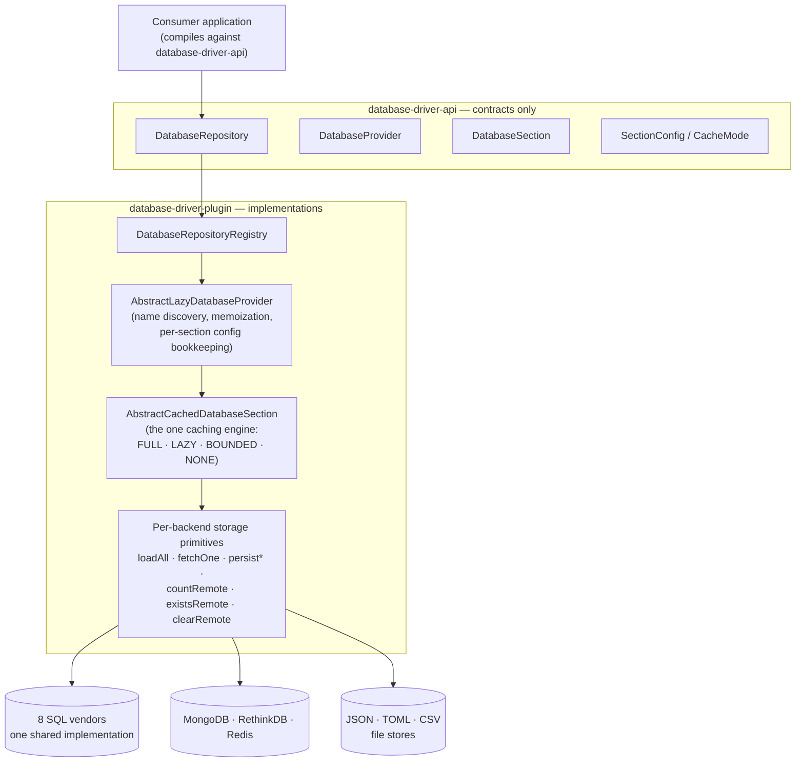
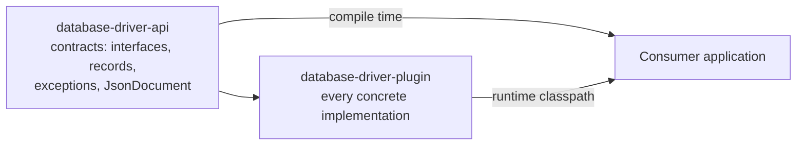
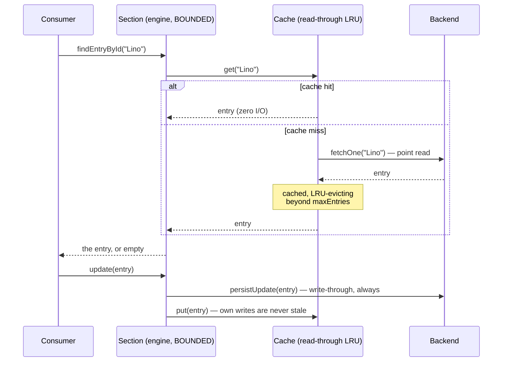

# DatabaseDriver


`database-driver-v2` is a management system for multiple SQL and NoSQL database types,
controlled through a single, unified Java interface. Instead of learning a separate API for
every backend, you work against `DatabaseRepository`, `DatabaseProvider`, `DatabaseSection` and
`DatabaseEntry` — the same four abstractions regardless of whether the data actually lives in
MySQL, MongoDB, Redis or a plain directory of JSON, TOML or CSV files. Every operation is also
available in a non-blocking, `CompletableFuture`-based variant, and every section's memory
footprint is configurable per section — from "everything cached in memory" down to "nothing at
all".

The library ships in **two editions with one contract**: the original Java modules
(`database-driver-api` / `database-driver-plugin`, Maven artifacts under `de.lino.database`)
and a class-for-class **Python mirror** under [`python/`](python/)
(`lino-database-driver-api` / `lino-database-driver-plugin`, importing as
`database_driver.api` / `database_driver.plugin`). Persisted data — entry documents,
`Credentials` config files, the file stores' on-disk layout — is byte-compatible between the
two, so the same repository can be read from Java and Python.

This README is the map of the project. Deeper documentation lives under [`docs/`](docs/).

---

## Table of Contents

- [Overview](#overview)
- [Features](#features)
- [Architecture](#architecture)
  - [System Architecture](#system-architecture)
  - [Module Architecture](#module-architecture)
  - [Data Flow](#data-flow)
- [Modules](#modules)
- [Project Structure](#project-structure)
- [Supported Databases](#supported-databases)
- [Requirements](#requirements)
- [Installation](#installation)
- [Configuration](#configuration)
- [Quick Start](#quick-start)
- [Library API](#library-api)
- [Python Edition](#python-edition)
- [Development](#development)
- [Testing](#testing)
- [Known Limitations](#known-limitations)
- [Roadmap](#roadmap)
- [Documentation](#documentation)
- [License](#license)
- [Author](#author)

---

## Overview

The driver is **one library, two Maven artifacts**: `database-driver-api` holds nothing but
contracts — the four core abstractions, the per-section cache configuration, the JSON document
model, the export/cache/notification contracts — and `database-driver-plugin` holds every
concrete implementation behind them. A consumer compiles against `-api` and puts `-plugin` on
the runtime classpath; nothing in application code ever names a concrete backend class. There
is no server and no standalone process: the driver runs inside the consumer's application.

Fourteen backend types hide behind the same interface. All eight SQL vendors share one
implementation (each table is a trivial `(id, data)` pair, the document serialized into the
`data` column), while every NoSQL backend — MongoDB, RethinkDB, Redis, and the JSON/TOML/CSV
file stores — maps sections onto its own native concept (collection, table, key prefix,
directory, file). One shared **caching engine** sits behind every backend and owns the question
the backends used to answer six different ways: *which entries live in heap, and when are they
loaded?* The answer is configurable per section, and connecting to a database costs time
proportional to its number of tables, never to the data inside them.

## Features

### Unified storage API

- One CRUD surface (`insert`/`update`/`delete`/`findEntryById`/`exists`/`count`/`clear`/`reload`)
  over 14 SQL and NoSQL backend types
- Sections (tables/collections/prefixes/directories) managed uniformly:
  create, delete, list, rediscover
- Every operation in a blocking and an `Async` (`CompletableFuture`) variant
- Entries are schema-less `JsonDocument`s with a fluent, type-safe accessor API
- Whole-provider conversion: copy every section and entry from one backend into another
  (`DatabaseRepository#convert`)

### Memory control

- Per-section cache modes: `FULL` (classic), `LAZY` (load on first access),
  `BOUNDED(maxEntries[, ttl])` (read-through LRU), `NONE` (zero heap)
- Lazy section discovery: connecting a provider reads names only — sections nobody asks for are
  never loaded
- Streaming reads (`forEachEntry`) in constant memory, and stable, id-ordered pagination
  (`getEntries(offset, limit)`) pushed down to the backend where it can order and slice natively
- Per-section cache statistics (hits, misses, load count/duration) and an external-invalidation
  hook for multi-process deployments

### Beyond storage

- `ExportCoordinator`: transcript-style exports to PDF/Excel/CSV/XML/JSON/DOCX, flat-table
  exports via injected exporters, whole-directory ZIP archives
- A standalone async `Cache`/`ClusteredCache` SPI (stampede protection, TTL, approximate-LRU
  size bound), usable by any consumer
- `DatabaseNotification`: push-style row-change notifications (PostgreSQL `LISTEN`/`NOTIFY`;
  Redis sections publish a compatible change feed)
- Self-seeding `Credentials` config files: pass connection details once, read them from disk
  ever after

## Architecture

### System Architecture



Every backend supplies only its storage primitives; caching strategy, write-through rules,
exception behavior and pagination live exactly once, in the engine. Full detail:
[docs/architecture.md](docs/architecture.md).

### Module Architecture

Dependency direction is strictly one-way:



An arrow `A --> B` reads: B builds on A — B may depend on A's types, never the reverse.
`database-driver-api` must never depend on `database-driver-plugin`, and it carries no
third-party database drivers — only Guava, Gson, Lombok and the JetBrains annotations.
Implementation discovery that crosses the boundary (the `Cache` SPI) runs over
`java.util.ServiceLoader`.

### Data Flow

A representative read on a `BOUNDED`-mode section — the path that keeps heap flat while every
entry stays reachable:



Writes behave identically in every mode: persist first, then synchronize whatever cache state
exists. `FULL`/`LAZY` serve reads from a materialized in-memory view instead; `NONE` sends
every call straight to the backend.

## Modules

| Module | Artifact | Responsibility |
|---|---|---|
| `database-driver-api` | `de.lino.database:database-driver-api` | The public API: `DatabaseRepository`, `DatabaseProvider`, `DatabaseSection`, `DatabaseEntry`, `Credentials`, the per-section cache configuration (`SectionConfig`/`CacheMode`), the JSON document model (`JsonDocument`), the driver's exceptions, the `Cache`/`ClusteredCache` contracts, the export contracts, and the `DatabaseNotification` push-notification contract |
| `database-driver-plugin` | `de.lino.database:database-driver-plugin` | The concrete implementation: `DatabaseRepositoryRegistry`, the shared section caching engine (`AbstractCachedDatabaseSection`) and lazy section discovery (`AbstractLazyDatabaseProvider`), one `DatabaseProvider`/`DatabaseSection` pair per supported backend, the default `Cache`/`ClusteredCache` implementations (ServiceLoader-registered), `ExportCoordinator`, and the Postgres/Redis notification implementations |
| `python/database-driver-api` | `lino-database-driver-api` | The Python mirror of `-api`: the same contracts as abstract base classes and `Protocol`s, `JsonDocument`, `Credentials`, `SectionConfig`/`CacheMode` — zero runtime dependencies, importing as `database_driver.api` |
| `python/database-driver-plugin` | `lino-database-driver-plugin` | The Python mirror of `-plugin`: the same registry, caching engine, backends (drivers as opt-in extras), caches (entry-point-registered) and `ExportCoordinator`, importing as `database_driver.plugin` |

## Project Structure

```text
database-driver-v2/
├── database-driver-api/                          # contracts (no database drivers)
│   └── src/main/java/de/lino/database/
│       ├── DatabaseRepository.java               # entry point, singleton accessor
│       ├── database/                             # DatabaseProvider/Section/Type, SectionConfig, CacheMode
│       │   ├── auth/                             # Credentials (self-seeding config file)
│       │   ├── entity/                           # DatabaseEntry, Serialized
│       │   ├── exception/                        # DataAlreadyExist, NoSuchEntryFound, NoSuchDataFound
│       │   └── notification/                     # DatabaseNotification contract
│       ├── json/                                 # JsonDocument model + FileProvider contract
│       └── utils/                                # Cache/ClusteredCache contracts, export contracts
├── database-driver-plugin/                       # implementations
│   ├── src/main/java/de/lino/database/
│   │   ├── DatabaseRepositoryRegistry.java       # concrete repository + TTL sweep scheduler
│   │   ├── database/
│   │   │   ├── AbstractCachedDatabaseSection.java   # the caching engine (all modes)
│   │   │   ├── AbstractLazyDatabaseProvider.java    # lazy discovery + section lifecycle
│   │   │   ├── sql/                              # shared SQL impl + 8 vendor subpackages
│   │   │   └── nosql/                            # mongodb/ rethinkdb/ redis/ json/ toml/ csv/
│   │   └── utility/                              # DefaultCache, ExportCoordinator, ...
│   └── src/test/java/                            # JUnit 5 suite (engine, modes, paging, TOML)
├── python/                                       # the Python mirror (same package layout)
│   ├── database-driver-api/
│   │   ├── src/database_driver/api/              # contracts: database/, json/, utils/ — one
│   │   │                                         #   module per Java class, same package paths
│   │   └── tests/                                # pytest suite (contracts, JsonDocument, Credentials)
│   └── database-driver-plugin/
│       ├── src/database_driver/plugin/           # registry, engine, database/sql/ + nosql/,
│       │                                         #   utility/cache/ + export/
│       └── tests/                                # pytest suite (engine modes, SQLite, stores, exports)
├── docs/                                         # documentation (see table below)
├── .github/workflows/                            # CI (Java + Python), Qodana, release publishing
└── pom.xml                                       # Maven reactor root
```

## Supported Databases

### Relational (SQL) Databases

| Database | Description |
|---|---|
| [MySQL](https://www.mysql.com/) | Widely used for web applications, content management systems, and general relational data storage |
| [MariaDB](https://mariadb.org) | Drop-in replacement for MySQL with improved performance and security features; used in web and cloud applications |
| [PostgreSQL](https://www.postgresql.org/) | Advanced relational database for complex queries, analytics, GIS, and applications needing strong standards compliance |
| [SQLite](https://www.sqlite.org) | File-based, serverless database often used in mobile apps, embedded systems, small desktop tools, and prototyping |
| [H2 Database](https://www.h2database.com) | Lightweight, in-memory or embedded database mainly for development, testing, or small applications |
| [Apache Derby](https://db.apache.org/derby) | Runs in-process (embedded), suited to small apps or unit tests rather than high-traffic production |
| [Microsoft SQL Server](https://www.microsoft.com/de-de/sql-server) | Strong integration with the Microsoft ecosystem; scales to medium and large enterprise applications |
| [Oracle Database](https://www.oracle.com/database/) | Designed for high concurrency, reliability, and large datasets, with complex transaction support |

### Non-Relational (NoSQL) Databases

| Database | Description |
|---|---|
| [MongoDB](https://www.mongodb.com/) | Document-oriented database for flexible, semi-structured data; one collection per section |
| [RethinkDB](https://rethinkdb.com) | Real-time database aimed at live updates and push notifications; one table per section |
| [Redis](https://redis.io) | In-memory data store used as cache, database and message broker; one key prefix per section, plus a Pub/Sub change feed |
| JSON File Store | Local JSON files, one directory per section and one file per entry; suitable for small projects, configs, or prototyping without a database server |
| TOML File Store | The same one-directory-per-section layout, with each entry a human-editable [TOML](https://toml.io) file — handy when stored data doubles as configuration. TOML's model limits apply: no `null` values (dropped on write) and homogeneous arrays only |
| CSV File Store | One CSV file per section, one row per entry. Both columns are Base64-encoded so arbitrary ids and documents round-trip safely, which means the raw file is not meant to be hand-edited |

> **Note:** `database-driver-plugin` ships JDBC drivers for PostgreSQL, H2, SQLite and MariaDB
> (plus the MongoDB, RethinkDB and Jedis/Redis clients, and the `toml4j` parser behind the TOML
> file store) out of the box. It does **not** bundle drivers for **MySQL**, **Oracle**,
> **Microsoft SQL Server** or **Apache Derby** — add the corresponding JDBC driver to your own
> project if you use one of these. In the Python edition every network driver is an opt-in pip
> extra instead; see [docs/api-reference.md](docs/api-reference.md#databasetype).

## Requirements

| Requirement | Notes |
|---|---|
| JDK **21** | Both modules' compiler source/target; consumers need a Java 21+ runtime |
| Maven 3.x | No wrapper is committed — use a local install |
| GitHub Packages read access | The artifacts are published to GitHub Packages, not Maven Central — a token with `read:packages` must be configured in `~/.m2/settings.xml` under server id `github` |
| A database server (optional) | Only for the network backends you actually use; SQLite, H2 and the JSON/TOML/CSV stores run without any server |
| Python **3.11+** (Python edition only) | For the mirror under `python/`; the Java toolchain is not needed to use it, and vice versa |

## Installation

Build from a clone:

```bash
git clone https://github.com/linoalessio/database-driver-v2.git
cd database-driver-v2
mvn clean verify
```

To consume the published Maven artifacts instead, three steps are needed — point Maven at
GitHub Packages, authenticate with a `read:packages` token, and declare both dependencies
(`-api` at compile scope, `-plugin` on the runtime classpath). The Python packages are not on
any index yet and install from a clone. Full instructions:
[docs/getting-started.md](docs/getting-started.md).

## Configuration

The driver reads **no environment variables** and has no global config file. Connection details
are passed as a `Credentials` object, which persists them to a JSON file on first use and reads
that file back on every subsequent run — so the file, not the caller, is the source of truth
after the first run. Cache behavior is configured in code, per section.

```java
// Network backends: host, user, password, port, database.
new Credentials(Paths.get("config/database.json"), "<HOST>", "<USER>", "<DB_PASSWORD>", <PORT>, "<DATABASE>");

// File-based backends (SQLITE, H2_DB, JSON, TOML, CSV): the repository path.
new Credentials(Paths.get("config/database.json"), Paths.get("data"));
```

The config file stores the password **in plaintext** — keep it out of version control and off
shared filesystems. Every key, every per-backend meaning, and the full secrets guidance:
[docs/configuration.md](docs/configuration.md).

## Quick Start

A complete, server-less round trip using the JSON file store:

```java
import de.lino.database.DatabaseRepository;
import de.lino.database.DatabaseRepositoryRegistry;
import de.lino.database.database.*;
import de.lino.database.database.auth.Credentials;
import de.lino.database.database.entity.DatabaseEntry;
import de.lino.database.json.JsonDocument;

import java.nio.file.Paths;

// 1. Initialize the repository once, in your main class.
new DatabaseRepositoryRegistry(/* logBytes = */ false);

// 2. Register a provider - here the JSON file store, so no server is needed.
final Credentials credentials = new Credentials(Paths.get("config/database.json"), Paths.get("data"));
final DatabaseProvider provider = DatabaseRepository.getInstance()
        .registerDatabaseProvider(1, DatabaseType.JSON, credentials);

// 3. Create a section and work with entries.
final DatabaseSection players = provider.createSection("players");
players.insert(new DatabaseEntry("Lino", new JsonDocument("name", "lino").append("age", 23)));

players.findEntryById("Lino")
        .ifPresent(entry -> System.out.println(entry.getMetaData().getString("name")));

// 4. Shut everything down on exit.
DatabaseRepository.getInstance().shutdown();
```

Success looks like `lino` on stdout and a `data/players/Lino.json` file on disk. Swapping the
backend means changing `DatabaseType.JSON` (and the credentials) — nothing else.

## Library API

Five entry points cover the whole surface. Each links to its reference and worked examples.

| Area | What it is |
|---|---|
| `DatabaseRepository` | Registers, finds, converts and shuts down providers; the singleton every call starts from |
| `DatabaseProvider` / `DatabaseSection` / `DatabaseEntry` | The storage surface: sections per backend, CRUD plus streaming and paging per section, schema-less `JsonDocument` entries |
| `SectionConfig` / `CacheMode` | Per-section memory policy: `full()`, `lazy()`, `bounded(n[, ttl])`, `none()` |
| `Caches` → `Cache` / `ClusteredCache` | A standalone async cache SPI with stampede protection, TTL and approximate-LRU bounds |
| `ExportCoordinator` and `DatabaseNotification` | Transcript/table/archive exports, and push-style row-change notifications |

Every operation also exists as an `Async` variant returning a `CompletableFuture`. The complete
surface is in [docs/api-reference.md](docs/api-reference.md); task-oriented examples for each
area are in [docs/api-usage.md](docs/api-usage.md).

## Python Edition

The [`python/`](python/) directory holds a class-for-class mirror of both Maven modules: every
Java class maps to one Python module at the identical package path
(`de.lino.database.database.sql.SQLDatabaseSection` →
`database_driver.plugin.database.sql.sql_database_section`), and the two distributions share
one PEP 420 namespace root the way the two Maven artifacts share `de.lino.database`:

```python
from pathlib import Path

from database_driver.api import Credentials, DatabaseRepository, DatabaseType
from database_driver.plugin import DatabaseRepositoryRegistry

DatabaseRepositoryRegistry(log_bytes=False)

credentials = Credentials(Path("config/database.json"), file_repository=Path("data"))
provider = DatabaseRepository.get_instance().register_database_provider(1, DatabaseType.JSON, credentials)

players = provider.create_section("players")
```

The contract is the Java one, translated at the language boundary and nowhere else:

- **Sync + async, mirrored.** Every operation has a `*_async` coroutine counterpart
  (`insert`/`insert_async`, …). The default async methods offload via `asyncio.to_thread`,
  exactly as the Java defaults offload to the `CompletableFuture` common pool.
- **Same engine, same semantics.** `AbstractCachedDatabaseSection` (all four cache modes,
  stats, TTL sweeps, `on_external_invalidate`) and `AbstractLazyDatabaseProvider` (name-only
  discovery) are line-for-line ports; the pagination, streaming and exception contracts are
  identical.
- **`ServiceLoader` → entry points.** The plugin registers its `DefaultCacheProvider` under
  the `database_driver.cache_provider` entry-point group; the api package's caches module
  discovers it automatically.
- **Drivers as extras.** Unlike the Java plugin, which bundles every driver jar, each network
  backend is an opt-in pip extra (`postgres`, `mysql`, `mssql`, `oracle`, `mongodb`, `redis`,
  `rethinkdb`) with lazy imports; the file stores, SQLite, both caches and the stdlib
  exporters (CSV/XML/JSON + zip) work with no extra at all. `export` adds the PDF/XLSX/DOCX
  transcript exporters (reportlab, openpyxl, python-docx).

Deliberate deviations from the Java edition, all documented in the code:

| Deviation | Why |
|---|---|
| `H2_DB` / `APACHE_DERBY` raise `NotImplementedError` | Both are embedded **JVM** databases — a Java library, not a wire protocol; no Python driver can exist. SQLite covers the embedded use case |
| SQLite `clear()` issues `DELETE FROM` | SQLite has no `TRUNCATE`; the Java edition's unconditional `TRUNCATE` fails silently there, leaving the rows in place |
| PostgreSQL/MySQL table discovery queries fixed | Lowercase `'public'` and `DATABASE()` respectively — the Java patterns return empty on those vendors |
| Strict JSON parsing | A hand-edited file that no longer parses strictly fails loudly instead of being silently reinterpreted |
| Redis counter service named `RedisPyCounterService` | The Java name (`JedisRedisCounterService`) encodes its client; this edition's client is redis-py |

The Python packages version independently of the Java modules (starting at `0.1.0`;
`1.0.0` when the mirror is complete) and are exercised by their own CI matrix
([`python.yml`](.github/workflows/python.yml): ruff, mypy, pytest on Python 3.11–3.13),
path-filtered so a commit touching one edition never builds the other.

## Development

```bash
export JAVA_HOME="$(/usr/libexec/java_home -v 21)"   # JDK 21 is mandatory (macOS example)

mvn clean verify                                     # full build + tests, both modules
mvn -pl database-driver-api,database-driver-plugin -am compile    # compile only
mvn -pl database-driver-plugin -am install -DskipTests            # install locally for a consumer project
```

Python edition (each package under `python/` is its own project):

```bash
pip install -e ./python/database-driver-api -e "./python/database-driver-plugin[dev]"

cd python/database-driver-api    && ruff check src tests && mypy && pytest
cd python/database-driver-plugin && ruff check src tests && mypy && pytest
```

Two rules bind every change: the dependency direction `api ← plugin` is one-way, and
`database-driver-api` carries no third-party database drivers. Every public and protected
member gets documentation explaining *why*, not just what — match the depth of the existing
files. The full contribution rules, the recipes for adding a backend or an export format, and
the documentation-maintenance contract are in
[docs/contributing.md](docs/contributing.md).

## Testing

Both editions carry real automated suites covering the shared caching engine and every backend
that needs no external server — every cache mode against the JSON file store and SQLite, lazy
discovery, streaming and paging, stats and invalidation, and the TOML store end to end. The
Java edition runs a **JUnit 5** suite of 31 tests via `mvn verify`; the Python mirror
runs **82 pytest cases** that port the same semantics and add coverage the Java module lacks
(the cache implementations, the consistent-hash ring, the registry, and all six transcript
export formats).

The network backends (MySQL/MariaDB/PostgreSQL/Oracle/SQL Server, MongoDB, RethinkDB, Redis),
the notification implementations and the Redis counter service have **no automated tests** in
either edition — they share the tested engine, but their own storage primitives are verified
manually against real servers. There is no coverage measurement. Details, per-suite scope and
what each CI workflow runs: [docs/testing.md](docs/testing.md).

## Known Limitations

- `ClusteredCache` shards **within a single JVM** — it is not a distributed, multi-process
  cache, and the driver's own section caching deliberately does not use it.
- Cross-process cache coherence is opt-in, not automatic: a `full()`/`lazy()` section only
  notices external writes on `reload()`, a `bounded(...)` one after its TTL (or an explicit
  `onExternalInvalidate`) — wiring a change feed to that hook is the consumer's job.
- The CSV store has no true point reads — `bounded(...)`/`none()` work but scan the file per
  lookup, and updates rewrite the whole file; `full()` remains the right mode for it. The same
  holds for Redis section `count()` in non-materialized modes (a `SCAN` over the keyspace).
- `findEntryById` misses are never negatively cached: repeated lookups of an absent id hit the
  backend every time.
- Section `stats()` hit/miss numbers are approximate under heavy concurrency (stampeded misses
  count once) — they are monitoring signals, not an audit trail.
- `clear()` on SQLite issues `TRUNCATE TABLE`, which SQLite does not support — the in-memory
  view empties but the rows survive a `reload()`. Long-standing behavior, preserved as-is in
  the Java edition; the Python edition issues `DELETE FROM` instead and genuinely clears.
- The Python edition cannot support H2 or Apache Derby (embedded JVM databases with no wire
  protocol); registering either `DatabaseType` there raises `NotImplementedError`.
- The RethinkDB backend carries known pre-existing defects (its row parser checks a `data` key
  that its own writer never stores, and its update statement is not row-scoped) — preserved
  bit-for-bit through the engine refactor rather than silently changed; treat the backend as
  experimental.
- The JSON and TOML stores use the same directory-per-section layout and cannot tell each
  other's sections apart — give each file-based provider its own repository root.
- `JsonDocument.append(String, byte[])` writes Base64 while `getBinary(String)` reads back
  through `BigInteger`; the two are not inverses, so binary payloads need your own encoding.
- The `Credentials` config file stores the database password in plaintext.

## Roadmap

- [ ] Change-feed listener infrastructure that drives `onExternalInvalidate` automatically
      (today only the eviction hook ships; the wiring is manual)
- [ ] Negative caching (bounded absent-id memory) for `bounded(...)` sections
- [ ] Eviction counters surfaced in section `stats()`
- [ ] Integration test harness for the server-backed backends
- [ ] A real multi-process cache adapter behind the same engine seam, if the library ever
      gains genuine distribution
- [ ] Publish the Python packages to an index (they install from a clone today)

## Documentation

| Document | Description |
|---|---|
| [`docs/architecture.md`](docs/architecture.md) | Components, section lifecycle, the shared caching engine, per-backend storage mapping, layering rules, performance posture |
| [`docs/getting-started.md`](docs/getting-started.md) | Building both editions from a fresh clone, and consuming the published artifacts |
| [`docs/configuration.md`](docs/configuration.md) | The `Credentials` config file: every key, per-backend constructors, secrets handling |
| [`docs/api-reference.md`](docs/api-reference.md) | The complete public surface of both editions, entry by entry |
| [`docs/api-usage.md`](docs/api-usage.md) | Worked examples: CRUD, cache modes, exports, caches, notifications, and the Python edition |
| [`docs/testing.md`](docs/testing.md) | What is verified, the exact commands, per-suite scope, and what CI does and does not check |
| [`docs/deployment.md`](docs/deployment.md) | How releases reach GitHub Packages, and what a consuming application must ship |
| [`docs/contributing.md`](docs/contributing.md) | Module boundaries, code conventions, recipes for recurring changes, and the documentation-maintenance contract |

## License

This project is licensed under the Apache License 2.0 — see [LICENSE.txt](LICENSE.txt).

## Author

**Lino Alessio Kauschinger**

GitHub: [https://github.com/linoalessio](https://github.com/linoalessio)
