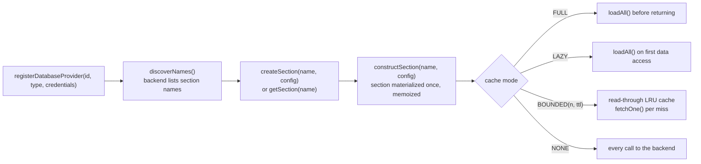

# Architecture

This page covers how the driver fits together internally: the module layout, the shared
caching engine every backend plugs into, how each backend maps sections and entries onto its
native concepts, and the rules a change must not break. For the top-level diagrams (system
architecture, module dependency direction, data flow), see the [root README](../README.md#architecture);
for building the project, see [getting-started.md](getting-started.md); for the public API
surface, see [api-reference.md](api-reference.md).

## Components

| Component | Kind | Deployable unit |
|---|---|---|
| `database-driver-api` | contracts (interfaces, records, enums, exceptions, `JsonDocument`) | Maven artifact `de.lino.database:database-driver-api` |
| `database-driver-plugin` | every concrete implementation | Maven artifact `de.lino.database:database-driver-plugin` |
| `python/database-driver-api` | the same contracts as abstract base classes / `Protocol`s | pip distribution `lino-database-driver-api` |
| `python/database-driver-plugin` | the same implementations, drivers as opt-in extras | pip distribution `lino-database-driver-plugin` |

There is no server and no standalone process: the driver is a library that runs inside the
consumer's process. A consumer compiles against `-api` and puts `-plugin` on the runtime
classpath (or installs both pip packages); application code never names a concrete backend
class.

## How the system actually runs

Constructing `DatabaseRepositoryRegistry` (once, at application startup) does three things:

1. Installs itself as the `DatabaseRepository` singleton (`DatabaseRepository.getInstance()`).
2. Constructs a `DefaultFileProvider`, whose constructor installs the `FileProvider` singleton
   used internally by `JsonDocument.write` and the JSON/TOML/CSV file stores.
3. Records the `logBytes` flag (when true, the byte size of every inserted/updated document is
   printed).

Providers are then registered under caller-assigned integer ids. The registry holds them in a
`ConcurrentHashMap` keyed by id; registration and unregistration go through single atomic
`compute`/`remove` calls, so concurrent calls for the same id cannot race into
double-registration or double-shutdown. Registering an id twice throws `IllegalStateException`.

One process-wide daemon thread (`database-driver-ttl-sweeper`) is started lazily when the
first TTL-bearing cache appears and calls `evictExpired()` on every registered cache every
60 seconds. `DatabaseRepository.shutdown()` shuts down every provider, then stops the sweeper.

### Section lifecycle: lazy discovery, on-demand materialization

Connecting a provider reads **names only** — no row data. Startup cost is proportional to the
number of tables, never to the data inside them.

Re-declaring a section with the same `SectionConfig` returns the existing instance; with a
different one, the newest declaration wins and the section is rebuilt (cache state dropped,
never the data). `DatabaseProvider.reload()` rebuilds the name list from the backing store and
detaches previously returned section instances — re-fetch via `getSection`.

## The engine: one implementation of caching, many storage primitives

All caching strategy, write-through rules, exception behavior, streaming and pagination live
exactly once, in two abstract classes in `database-driver-plugin`
(`de.lino.database.database`):

- **`AbstractLazyDatabaseProvider`** — section-name discovery, memoization and lifecycle. A
  backend supplies three primitives: `discoverNames`, `constructSection`, `dropSectionRemote`.
- **`AbstractCachedDatabaseSection`** — the caching engine (all four `CacheMode`s, stats, TTL
  registration, external invalidation). A backend supplies eight storage primitives:
  `loadAll`, `fetchOne`, `persistInsert`, `persistUpdate`, `persistDelete`, `countRemote`,
  `existsRemote`, `clearRemote` — plus an optional `pageRemote(offset, limit)` override where
  the backend can order and slice natively.

Semantics guaranteed by the engine, identical for every backend and both editions:

- **Writes are always write-through**: persist first, then synchronize whatever cache state
  exists. A process always reads its own writes. `DataAlreadyExist`/`NoSuchEntryFound` behave
  identically in every mode.
- **`bounded(...)`/`none()` answer `count()`/`exists(...)`/`getEntries()` from the backend** —
  a partial cache can prove presence but never absence — while `full()`/`lazy()` answer from
  the materialized view and need `reload()` to notice external writes.
- **Pagination is stable and id-ordered** in every mode. Backends without native ordering
  (e.g. the CSV store) fall back to the engine's default `pageRemote`, which streams all
  entries through a bounded priority-queue window of `offset + limit` entries.
- **Streaming (`forEachEntry`) runs in constant memory**; every backend reads in bounded
  batches under the hood.
- `stats()` exposes cache hits/misses and full-load count/duration per section;
  `onExternalInvalidate(id)` evicts one entry from whatever cache state exists. Both live on
  `AbstractCachedDatabaseSection`, not the `DatabaseSection` interface.

The Python engine (`database_driver.plugin.database.abstract_cached_database_section` /
`abstract_lazy_database_provider`) is a line-for-line port with the same primitives and the
same guarantees.

## Backend storage mapping

One `DatabaseProvider`/`DatabaseSection` pair per backend; all SQL vendors share a single
implementation.

| Backend(s) | Section maps to | Entry maps to |
|---|---|---|
| all 8 SQL vendors (`database.sql`) | one table | one row in a two-column schema `(id TEXT, data <blob type>)`; `data` holds the serialized JSON document. Blob type per vendor: PostgreSQL `BYTEA`, MySQL/MariaDB `LONGBLOB`, SQL Server `VARBINARY(MAX)`, SQLite/H2/Oracle/Derby `BLOB` |
| MongoDB (`database.nosql.mongodb`) | one collection (`system.version`/`system.users` are skipped during discovery) | one document `{id, data}` |
| RethinkDB (`database.nosql.rethinkdb`) | one table | one row `{id, values}` (see the RethinkDB caveat in the README's Known Limitations) |
| Redis (`database.nosql.redis`) | one key prefix `section:` | one key `section:id`, value = serialized document; discovery and scans use `SCAN` in batches of 100 |
| JSON file store (`database.nosql.json`) | one subdirectory | one `<id>.json` file containing `{id, data}` |
| TOML file store (`database.nosql.toml`) | one subdirectory | one `<id>.toml` file (TOML's model applies: `null` dropped, homogeneous arrays only) |
| CSV file store (`database.nosql.csv`) | one `<section>.csv` file | one line `base64(id),base64(document bytes)` |

The SQL layer (`SQLDatabaseProvider`/`SQLDatabaseSection`/`SQLExecution`) differs per vendor
only in the JDBC URL shape, the table-listing query, the blob column type and the paging
dialect (`LIMIT ? OFFSET ?` vs. `OFFSET ? ROWS FETCH NEXT ? ROWS ONLY` for Oracle, SQL Server
and Derby). `SQLDatabaseProvider.getSqlExecution()` is the documented escape hatch for raw
vendor-specific SQL (since 1.3.16).

## Layering rules

Stated as rules, because changes that break them are wrong even when they compile:

1. **`database-driver-api` must never depend on `database-driver-plugin`** — the api module is
   what consumers compile against; a reverse edge would drag every driver onto their compile
   classpath.
2. **`database-driver-api` carries no third-party database drivers** — only Guava, Gson,
   Lombok and the JetBrains annotations. The Python api package carries *zero* runtime
   dependencies.
3. **Implementation discovery crosses the boundary only via `ServiceLoader`** (Java:
   `META-INF/services/de.lino.database.utils.cache.provider.CacheProvider`) **or entry points**
   (Python: group `database_driver.cache_provider`) — never via a hard class reference from
   api to plugin.
4. **Backends implement storage primitives only.** Caching behavior belongs in the engine; a
   backend that reimplements caching forks the semantics the tests pin.
5. Package naming: API contracts live under `de.lino.database.utils.*`, plugin implementations
   under `de.lino.database.utility.*` — this asymmetry is deliberate and load-bearing (the
   `ServiceLoader` resource is named after the api package, its content after the plugin one).

## Data handling

- Every entry is a schema-less JSON document wrapped as `{"id": ..., "data": {...}}`. A stored
  record missing its `data` payload raises `NoSuchDataFound`.
- Persisted bytes are **identical between the Java and Python editions** — entry documents,
  `Credentials` config files and the file stores' on-disk layout are byte-compatible, so the
  same repository can be read from both.
- SQL connections are pooled per provider via HikariCP (pool size 10) in Java, and a
  queue-based pool of the same size in Python. Redis uses a connection pool of up to 50.
- Full loads stream (`SELECT *` with fetch size 256 on SQL; `SCAN` batches of 100 on Redis;
  directory listings on the file stores) rather than materializing result sets.

## Performance posture

Designed-in facts, not benchmarks:

- Connecting a provider costs one name-discovery query; nothing else is read until a section
  is asked for data.
- `BOUNDED` caches evict by **approximate LRU** (a sample of 8 entries per eviction, the Redis
  approach) so inserts stay O(1); TTL eviction is a periodic O(n) sweep on the shared
  60-second sweeper thread, never on the hot path.
- The CSV store has no native point reads or paging — lookups scan the file, updates rewrite
  it; `full()` mode is the right choice for it.
- `ClusteredCache` shards within a single JVM/process — consistent hashing with virtual nodes
  (SHA-256, 100 vnodes per shard) and optional replication, but no network distribution.
