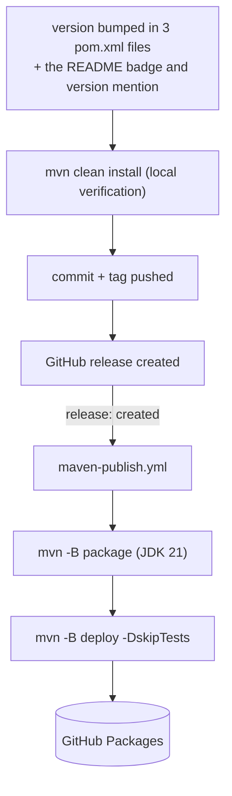

# Deployment

This project is a **library**, not a deployed service: there is no server process, no
container image, no infrastructure manifest, and nothing in the repository deploys to a host.
"Deployment" here means publishing the artifacts consumers depend on. For building locally see
[getting-started.md](getting-started.md); for what CI verifies see [testing.md](testing.md).

## Published artefacts

| Artefact | Registry | Status |
|---|---|---|
| `de.lino.database:database-driver-api` | GitHub Packages (`https://maven.pkg.github.com/linoalessio/database-driver-v2`) | published per release |
| `de.lino.database:database-driver-plugin` | the same | published per release |
| `lino-database-driver-api` (Python) | — | **not published to any index**; install from a clone |
| `lino-database-driver-plugin` (Python) | — | **not published to any index**; install from a clone |

The Python packages version independently of the Java modules, starting at `0.1.0`.

## How a Java release reaches GitHub Packages

Publishing happens **only in CI**, never from a developer machine:

`maven-publish.yml` authenticates with the workflow's own `GITHUB_TOKEN` against the server id
`github`, which must keep matching the `<distributionManagement>` repository id in the root
`pom.xml` — and the `<server>` id consumers configure in their own `~/.m2/settings.xml`. The
automatic token can always write packages belonging to this repository, so no additional
secret is required. Both modules are deployed, since the root pom's
`<distributionManagement>` is inherited.

The release itself is cut manually by the maintainer, using a local script that is not part of
the repository. What the repository does define is everything after the release exists: the
workflow above is the only path by which artifacts are published.

### Versioning rule

A version bump touches **three** `pom.xml` files (root, `database-driver-api`,
`database-driver-plugin`) plus the version badge and the version mention in
[`README.md`](../README.md) — never just one. Git tags follow the `vX.Y.Z` form.

## Deploying an application that uses the driver

The driver runs inside the consumer's process; there is nothing of the driver's own to
operate. Two requirements carry over into any application deployment:

- **`database-driver-plugin` must be on the runtime classpath** (or `lino-database-driver-plugin`
  installed) — `-api` alone compiles but provides no working `DatabaseProvider`, and `Caches`
  throws when no `CacheProvider` is discoverable.
- **The `Credentials` config file must exist where the process can read it**, and holds the
  database password in plaintext — see
  [configuration.md](configuration.md#secrets-handling) for handling rules. Any JDBC driver
  the plugin does not bundle must also be supplied by the application.

File-based backends (`SQLITE`, `H2_DB`, `JSON`, `TOML`, `CSV`) additionally need their
repository directory to be writable by the process and included in whatever backup the
application performs; `ExportCoordinator.DirectoryZipExporter` can produce such a backup
archive (see [api-usage.md](api-usage.md#3-exporting-data)).

## Continuous integration

Four workflows run in this repository; [testing.md](testing.md#what-ci-runs) owns the full
table of what each runs and when.
