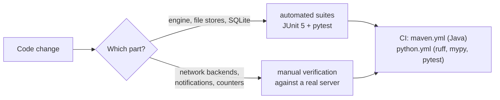

# Testing

Both editions carry real automated test suites covering the shared caching engine and every
backend that needs no external server. **The server-backed backends — MySQL, MariaDB,
PostgreSQL, Oracle, SQL Server, MongoDB, RethinkDB and Redis — have no automated tests in
either edition**; they share the tested engine, but their own storage primitives are verified
manually against real servers. The push-notification implementations and the Redis counter
service are likewise untested automatically.

For the commands in context of a full build, see
[getting-started.md](getting-started.md); for what the engine guarantees the tests pin, see
[architecture.md](architecture.md#the-engine-one-implementation-of-caching-many-storage-primitives).



## Java edition

Framework: **JUnit 5** (`org.junit.jupiter:junit-jupiter` 5.10.2, run by Surefire 3.2.5),
declared in `database-driver-plugin`. The api module has no test sources.

```bash
mvn clean verify                          # full build + tests, both modules
mvn -pl database-driver-plugin -am test   # just the suite
```

**31 tests** across six classes in
`database-driver-plugin/src/test/java/de/lino/database/database/`:

| Test class | Covers |
|---|---|
| `CacheModeJsonStoreTest` | All four cache modes against the JSON file store: `FULL` warm-at-creation, `LAZY` load-on-first-access, `BOUNDED` hit/miss split, TTL expiry, write-through, `NONE` pass-through, and section reconfiguration replacing the instance only on a real change |
| `CacheModeSqliteTest` | The same semantics over SQLite (the SQL path), tables surviving and being rediscovered across provider reload, and `BOUNDED` read-through seeing rows written before the cache existed |
| `LazyProviderDiscoveryTest` | Provider construction reading no row data, sections existing without materialization, `reload` rediscovering names and detaching old instances, `deleteSection` clearing store and bookkeeping |
| `StreamingAndPagingTest` | `forEachEntry` visiting everything once, identical paging contracts across all modes on the JSON store and SQLite, including the native SQL paging pushdown |
| `StatsAndInvalidationTest` | `stats()` hit/miss and full-load counters across warm-up and reload; `onExternalInvalidate` evicting from a bounded cache and from a materialized view |
| `TomlStoreTest` | The TOML store end to end: human-readable output with faithful types, update replacing rather than merging, parity with other sections in every mode |

All of them run against the JSON, CSV and TOML file stores and SQLite only — no server, no
network. Surefire reports land in `database-driver-plugin/target/surefire-reports/`.

## Python edition

Framework: **pytest** (plus `ruff` for linting and `mypy` for type checking; `mypy` is strict
for the api package and non-strict for the plugin, which talks to seven untyped drivers).

```bash
cd python/database-driver-api
ruff check src tests && mypy && pytest
```

```bash
cd python/database-driver-plugin
ruff check src tests && mypy && pytest
```

**82 test cases** across both packages (70 test functions, parametrized):

| Package / file | Covers |
|---|---|
| `database-driver-api/tests/test_api_contracts.py` | `JsonDocument` round-trips, file write/load, decimal and binary semantics, deep copy; `Serialized` keys and byte round-trip; `SectionConfig` normalization and validation; `Credentials` seed-then-read-back and `of()`; `ExportType` suffix handling; `PageLayout.DEFAULT`; the `DatabaseSection` default streaming/paging implementations and their async wrappers; `Pair` immutability |
| `database-driver-plugin/tests/test_cache_modes_json_store.py`, `test_cache_modes_sqlite.py`, `test_lazy_provider_discovery.py`, `test_streaming_and_paging.py`, `test_stats_and_invalidation.py`, `test_toml_store.py` | Ports of the six Java test classes, same semantics — plus an explicit assertion that `clear()` genuinely empties a SQLite table (a deliberate divergence from the Java edition) |
| `database-driver-plugin/tests/test_caches.py` | Coverage the Java module lacks: `DefaultCache` load-once and stampede protection under real threads, failed loads not being cached, TTL expiry, approximate-LRU eviction, snapshot contents; the consistent-hash ring; `DefaultClusteredCache` replication and routing; and that the entry-point SPI discovers the plugin's provider |
| `database-driver-plugin/tests/test_registry.py` | Singleton installation, register/find/unregister including duplicate and unknown ids, `H2_DB`/`APACHE_DERBY` raising `NotImplementedError` without leaving a half-registered id, `convert()` copying JSON → SQLite, async shutdown |
| `database-driver-plugin/tests/test_export_coordinator.py` | All six transcript formats, injection-required errors for table and archive exports, `DirectoryZipExporter` round-trip, and rejection of unknown extensions and empty headers |

No test requires a live database server: everything runs against temporary directories and
stdlib `sqlite3`. The PDF/XLSX/DOCX export tests `importorskip` their libraries, so they skip
cleanly when the `export` extra is absent.

## What CI runs

| Workflow | Trigger | Runs |
|---|---|---|
| `.github/workflows/maven.yml` | push and pull request to `master`, ignoring `**/*.md` and `python/**`; also manual | JDK 21 (Temurin), `mvn -B package` — builds both modules and runs the JUnit suite |
| `.github/workflows/python.yml` | push and pull request touching `python/**` or the workflow itself; also manual | Matrix of Python 3.11/3.12/3.13 × both packages: `ruff check src tests`, `mypy`, `pytest -q` |
| `.github/workflows/qodana_code_quality.yml` | push and pull request to `master`; also manual | JetBrains Qodana static analysis (`qodana.starter` profile), posting a pull-request comment and annotations |
| `.github/workflows/maven-publish.yml` | a GitHub release being created; also manual | `mvn -B package`, then `mvn -B deploy` to GitHub Packages — see [deployment.md](deployment.md) |

The path filters mean a commit touching one edition never builds the other, and a
documentation-only commit builds neither Java nor Python (Qodana still runs).

**What CI does not check**: the network backends, the notification implementations, the
release script, and any integration between this driver and a consuming application. There is
no coverage measurement in either edition.
